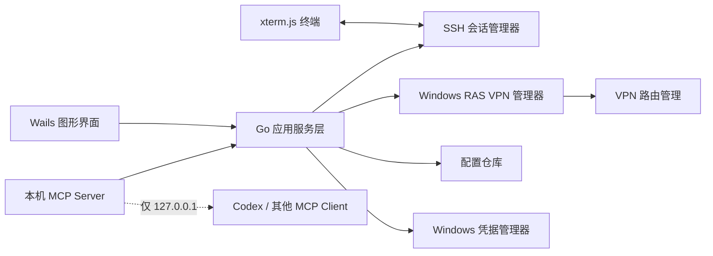
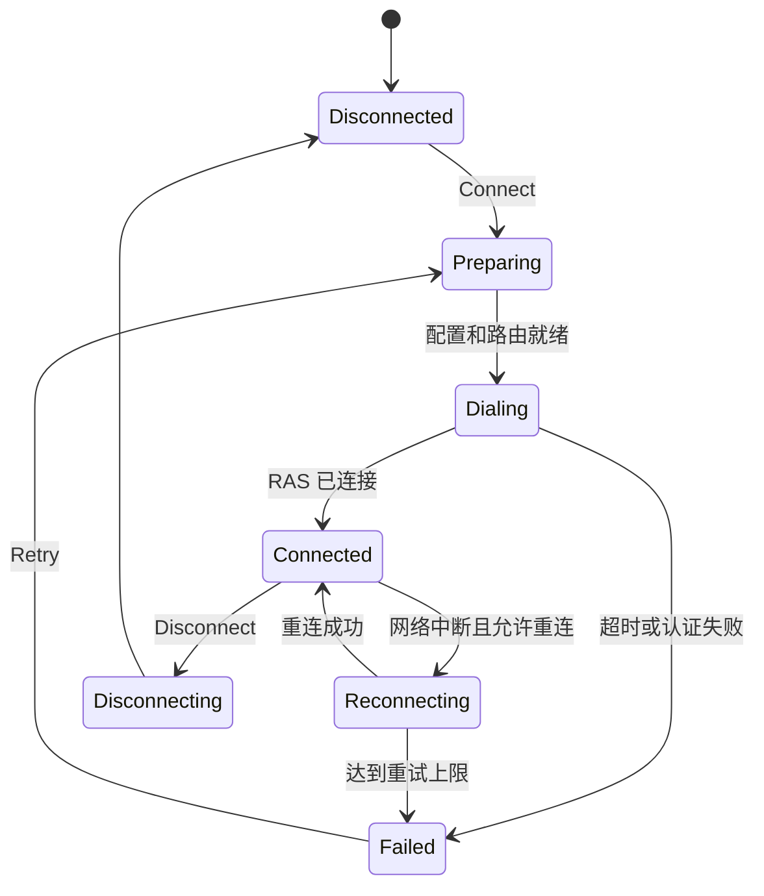

# LabRemote VPN + SSH + MCP 客户端开发手册

> 2026-07-18 架构更新：本文后续关于 Windows RAS、L2TP/IPsec、VPN Profile 和系统 `/32` 路由的设计已被进程内 SoftEther 原生传输取代，仅保留为历史设计记录。旧 RAS 源码由 `legacy_ras` 构建标签隔离，不进入默认测试、构建或发布产物。当前实现以 `README.md`、`internal/softether` 和 `internal/vpn/isolated_manager.go` 为准：应用不连接或修改 Windows VPN，不创建系统网卡或路由，SSH 通过用户态 TCP/IP 栈获得专用 `net.Conn`。

> 文档版本：1.0
> 编写日期：2026-07-18
> 目标平台：Windows 10 / Windows 11，amd64
> 核心语言：Go
> 产品形态：类 Xshell 桌面客户端，可选启用本机 MCP 服务

---

## 1. 项目目标

开发一款名为 `LabRemote` 的 Windows 桌面工具，把实验室 VPN 连接、SSH 登录、交互式终端和 MCP 服务整合到一个程序中。

用户只需要维护以下信息：

### 1.1 VPN 信息

1. 连接名称
2. 服务器名称或者地址
3. VPN 类型
4. 预共享密钥
5. 用户名
6. 密码

### 1.2 SSH 服务器信息

1. 服务器地址
2. 端口
3. 用户名
4. 密码

保存后，用户双击连接配置即可完成：

1. 检查并建立 VPN；
2. 自动准备目标服务器路由；
3. 检查 SSH 端口；
4. 建立 SSH 连接；
5. 在图形界面内打开交互式终端。

程序具有全局 MCP 功能开关：

- MCP 关闭：程序是普通的类 Xshell SSH 客户端；
- MCP 开启：程序继续正常提供图形终端，同时在本机启动 MCP 服务；
- 关闭 MCP 不得中断已经打开的图形 SSH 会话；
- MCP 服务不得向模型暴露 VPN 密码、预共享密钥或 SSH 密码。

---

## 2. 第一版范围

### 2.1 必须实现

- Windows 桌面图形界面；
- VPN + SSH 组合连接配置；
- VPN 配置的新增、编辑、删除；
- L2TP/IPsec 预共享密钥模式；
- VPN 自动连接、状态检测、超时和断开；
- 分流路由，不能把普通互联网流量全部导入实验室 VPN；
- SSH 密码认证；
- SSH 主机指纹确认和固定；
- 多标签交互式终端；
- ANSI 色彩、中文、窗口尺寸变化、复制和粘贴；
- MCP 开关、状态、端口和访问令牌展示；
- MCP 查询连接、建立 VPN、执行 SSH 命令和管理交互会话；
- Windows 凭据管理器保存秘密；
- 连接日志和 MCP 审计日志；
- Windows amd64 单机安装包。

### 2.2 推荐实现

- SSH 密钥认证；
- SFTP 文件管理；
- 端口转发；
- 命令片段；
- 会话分组；
- 主题、字体和快捷键设置；
- 自动重连；
- 系统托盘运行。

### 2.3 第一版暂不实现

- 自行实现 L2TP、IPsec 或 SoftEther 协议；
- 远程公网 MCP 服务；
- 团队账号、云同步、多人共享密码；
- Linux/macOS VPN 管理；
- RDP、VNC、Telnet 等其他协议。

程序应调用 Windows 自带的 RAS/VPN 能力，不重新实现 VPN 协议栈。

---

## 3. 关键前置约束

### 3.1 VPN 类型

实验室手册对应的是 Windows 原生 L2TP/IPsec + 预共享密钥模式。第一版应把它作为完整支持的类型：

```text
L2TP/IPsec（预共享密钥）
```

数据模型可以预留以下枚举：

```go
type VPNType string

const (
	VPNTypeL2TPPSK VPNType = "l2tp_psk"
	VPNTypePPTP    VPNType = "pptp"
	VPNTypeSSTP    VPNType = "sstp"
	VPNTypeIKEv2   VPNType = "ikev2"
)
```

第一版只保证 `l2tp_psk`。其他类型若需要证书、EAP XML 或额外认证信息，不能假装仅凭现有六个字段就一定能够连接。

### 3.2 VPN 客户端 IP 分配问题

实验室手册要求用户为 VPN 适配器填写一个 `192.168.190.x` 地址。这意味着当前 VPN 服务端可能没有为客户端可靠分配地址。

“用户只输入六个 VPN 字段”与“每个客户端必须手工选择不冲突的静态地址”之间存在冲突。仅凭用户名、密码和服务器地址，客户端无法百分之百判断某个静态地址是否已经被其他人使用。

开发前必须选择以下方案之一：

1. **推荐方案：服务端分配地址。** 让 SoftEther SecureNAT、DHCP、RADIUS 或其他地址池为 VPN 客户端分配唯一地址。客户端无需增加输入字段。
2. **实验室统一映射。** 由管理员维护“VPN 用户名 -> 客户端 IP”映射，随软件配置下发。普通用户仍只输入六个字段。
3. **高级字段兜底。** 基本界面不显示，高级设置允许指定 VPN 客户端 IP。该方案会增加实际输入项，不符合最初的理想交互，但比随机选取地址安全。

禁止在生产版本中仅通过随机数选择客户端 IP 并假定不会冲突。

### 3.3 自动路由

用户不需要填写路由。程序从 SSH 服务器地址自动生成路由：

- SSH 地址是 IPv4：添加 `<服务器IPv4>/32` 到对应 VPN 连接；
- SSH 地址是主机名：连接 VPN 后解析，给解析到的目标地址添加 `/32`；
- 一个 VPN 配置关联多个 SSH 服务器时，为每个目标地址添加一条 `/32`；
- 不使用手册中“目标主机地址配合 `/16` 掩码”的非规范写法；
- 如果实验室确认整个网段都应经过 VPN，可以由管理员默认配置下发网段路由。

Windows 的 `Add-VpnConnectionRoute` 可以把路由绑定到指定 VPN 配置，VPN 断开时路由不会继续错误指向已经消失的接口。

---

## 4. 技术选型

| 层级 | 选型 | 说明 |
|---|---|---|
| 核心语言 | Go 1.25+ | 网络、并发、Windows API、SSH、MCP 均由 Go 实现 |
| 桌面框架 | Wails v2.13.x | v2 为稳定线；v3 在本文编写时仍为 Alpha |
| 前端 | React + TypeScript | 仅负责界面和终端渲染，业务逻辑仍在 Go |
| 终端 | `@xterm/xterm` | 支持 ANSI、CJK、IME、搜索、复制和窗口适配 |
| SSH | `golang.org/x/crypto/ssh` | Go 官方扩展库，支持 PTY、Shell、命令执行和窗口尺寸变化 |
| Windows API | `golang.org/x/sys/windows` + 自有 RAS 封装 | 调用 `rasapi32.dll`、`advapi32.dll` 等系统 DLL |
| MCP | `github.com/modelcontextprotocol/go-sdk/mcp` | 官方 Tier 1 Go SDK |
| 本地配置 | JSON | 只存非敏感配置和凭据引用 |
| 秘密存储 | Windows Credential Manager | 调用 `CredWriteW`、`CredReadW`、`CredDeleteW` |
| 日志 | `log/slog` | JSON 行日志，统一脱敏 |
| 测试 | Go `testing` + 前端 Vitest | 核心模块通过接口替换为 Fake 实现 |

选择 Wails 而不是纯 Go 控件框架的主要原因是：类 Xshell 产品最难的不是普通表单，而是高质量终端渲染、输入法、ANSI、鼠标事件和全屏程序兼容。Wails 可以使用成熟的 xterm.js，同时保持 VPN、SSH、MCP 和安全模块全部由 Go 控制。

---

## 5. 总体架构



必须遵守以下分层：

- UI 不直接调用 PowerShell、RAS 或 SSH；
- MCP 不直接调用 RAS 或 SSH；
- UI 和 MCP 都调用同一个 `AppService`；
- 连接状态只在核心层维护，避免 UI 和 MCP 各自维护一套状态；
- 所有敏感信息通过 `SecretStore` 读取，不通过 MCP 输入参数传递。

---

## 6. 推荐目录结构

```text
labremote/
├─ cmd/
│  └─ labremote/
│     └─ main.go
├─ internal/
│  ├─ app/
│  │  ├─ service.go
│  │  ├─ connect_flow.go
│  │  └─ events.go
│  ├─ model/
│  │  ├─ profile.go
│  │  ├─ status.go
│  │  └─ errors.go
│  ├─ profile/
│  │  ├─ repository.go
│  │  └─ json_repository.go
│  ├─ secrets/
│  │  ├─ store.go
│  │  ├─ wincred_windows.go
│  │  └─ memory_store_test.go
│  ├─ vpn/
│  │  ├─ manager.go
│  │  ├─ state_machine.go
│  │  ├─ ras_windows.go
│  │  ├─ ras_types_windows.go
│  │  ├─ route_windows.go
│  │  └─ errors_windows.go
│  ├─ sshclient/
│  │  ├─ manager.go
│  │  ├─ client.go
│  │  ├─ terminal_session.go
│  │  ├─ command_session.go
│  │  └─ known_hosts.go
│  ├─ mcpserver/
│  │  ├─ server.go
│  │  ├─ auth.go
│  │  ├─ tools.go
│  │  ├─ session_store.go
│  │  └─ audit.go
│  ├─ policy/
│  │  ├─ mcp_policy.go
│  │  └─ command_policy.go
│  └─ logging/
│     ├─ logger.go
│     └─ redact.go
├─ frontend/
│  ├─ src/
│  │  ├─ components/
│  │  ├─ pages/
│  │  ├─ terminal/
│  │  ├─ stores/
│  │  └─ types/
│  └─ package.json
├─ build/
│  └─ windows/
├─ test/
│  ├─ integration/
│  └─ fixtures/
├─ go.mod
├─ go.sum
├─ wails.json
└─ README.md
```

Windows 专有文件使用 `_windows.go` 后缀。代码注释统一使用中文，所有文本文件使用 UTF-8 编码。

---

## 7. 数据模型

### 7.1 连接配置

```go
type ConnectionProfile struct {
	ID          string       `json:"id"`
	DisplayName string       `json:"display_name"`
	Group       string       `json:"group,omitempty"`
	VPN         VPNConfig    `json:"vpn"`
	SSH         SSHConfig    `json:"ssh"`
	MCPPolicy   MCPPolicy    `json:"mcp_policy"`
	CreatedAt   time.Time    `json:"created_at"`
	UpdatedAt   time.Time    `json:"updated_at"`
}

type VPNConfig struct {
	ConnectionName string  `json:"connection_name"`
	ServerAddress  string  `json:"server_address"`
	Type           VPNType `json:"type"`
	CredentialRef  string  `json:"credential_ref"`
	SplitTunnel    bool    `json:"split_tunnel"`
}

type SSHConfig struct {
	ServerAddress string `json:"server_address"`
	Port          uint16 `json:"port"`
	Username      string `json:"username"`
	CredentialRef string `json:"credential_ref"`
	HostKey       string `json:"host_key,omitempty"`
}

type MCPPolicy struct {
	EnabledForProfile bool `json:"enabled_for_profile"`
	AllowExec         bool `json:"allow_exec"`
	AllowInteractive  bool `json:"allow_interactive"`
	AllowDisconnect   bool `json:"allow_disconnect"`
}
```

`ConnectionProfile` 中禁止出现以下字段：

- VPN 预共享密钥；
- VPN 密码；
- SSH 密码；
- MCP 明文访问令牌。

### 7.2 凭据结构

凭据只在内存中短暂存在：

```go
type VPNSecret struct {
	PreSharedKey []byte
	Username     string
	Password     []byte
}

type SSHSecret struct {
	Password []byte
}
```

保存到 Windows Credential Manager 时使用以下 TargetName：

```text
LabRemote/<profile-id>/vpn-psk
LabRemote/<profile-id>/vpn-password
LabRemote/<profile-id>/ssh-password
LabRemote/global/mcp-token
```

用户名可以保存在普通配置中，但为了统一修改流程，也可以和密码一起保存为凭据属性。

密码从凭据库读出后应尽量使用 `[]byte`，使用结束后覆盖为零。Go 字符串不可原地清除，因此不要让密码在多个日志字段、错误对象或长生命周期结构中复制。

### 7.3 配置目录

```text
%APPDATA%\LabRemote\profiles.json
%APPDATA%\LabRemote\settings.json
%APPDATA%\LabRemote\known_hosts
%LOCALAPPDATA%\LabRemote\logs\app-YYYY-MM-DD.jsonl
%LOCALAPPDATA%\LabRemote\logs\mcp-audit-YYYY-MM-DD.jsonl
```

终端输出默认不持久化。

---

## 8. 图形界面规范

### 8.1 主窗口

```text
┌─────────────────────────────────────────────────────────────┐
│ 新建  编辑  删除  连接  断开       MCP [关闭/开启]  设置    │
├──────────────┬──────────────────────────────────────────────┤
│ 连接树        │ 标签：gpu-01 | server-02 | +                 │
│              ├──────────────────────────────────────────────┤
│ 实验室        │                                              │
│  ├ gpu-01    │                 交互式终端                    │
│  └ server-02 │                                              │
│              │                                              │
├──────────────┴──────────────────────────────────────────────┤
│ VPN：已连接  SSH：已连接  延迟：12ms  MCP：127.0.0.1:38765  │
└─────────────────────────────────────────────────────────────┘
```

### 8.2 新建/编辑连接对话框

按两个分组展示字段。

#### VPN

| 字段 | 控件 | 校验 |
|---|---|---|
| 连接名称 | 文本框 | 必填，1-64 字符，同一 Windows 用户下唯一 |
| 服务器名称或者地址 | 文本框 | 必填，IPv4、IPv6 或合法主机名 |
| VPN 类型 | 下拉框 | 第一版选择 L2TP/IPsec（预共享密钥） |
| 预共享密钥 | 密码框 | L2TP/PSK 必填，不回显 |
| 用户名 | 文本框 | 必填 |
| 密码 | 密码框 | 必填，不回显 |

#### SSH 服务器

| 字段 | 控件 | 校验 |
|---|---|---|
| 服务器地址 | 文本框 | 必填，推荐填写 VPN 内网 IPv4 |
| 端口 | 数字框 | 必填，1-65535，默认 22 |
| 用户名 | 文本框 | 必填 |
| 密码 | 密码框 | 必填，不回显 |

编辑现有配置时，密码框显示为空并带有“留空则保留已保存密码”的说明。另提供“清除已保存密码”按钮，不能用固定数量的圆点伪装成真实密码。

### 8.3 MCP 开关区域

关闭状态：

```text
MCP 服务：关闭
[开启 MCP]
```

开启状态：

```text
MCP 服务：已开启
地址：http://127.0.0.1:38765/mcp
[复制配置] [重新生成令牌] [关闭 MCP]
```

重新生成令牌会立即让旧令牌失效。复制配置时允许复制令牌，但应用日志不得记录剪贴板内容。

### 8.4 终端能力

- 多标签页；
- 标签显示连接名称和状态；
- `xterm-256color`；
- 自动适配行列；
- Ctrl+Shift+C 复制，Ctrl+Shift+V 粘贴；
- Ctrl+F 搜索；
- 中文输入法；
- ANSI 颜色；
- 鼠标滚轮和选择；
- 右键菜单；
- 终端响铃可关闭；
- 断线后在原标签显示原因和“重新连接”按钮。

---

## 9. 核心接口

UI 和 MCP 只依赖这些高层接口：

```go
type VPNManager interface {
	EnsureProfile(ctx context.Context, profile ConnectionProfile) error
	Connect(ctx context.Context, profileID string) (VPNStatus, error)
	Status(ctx context.Context, profileID string) (VPNStatus, error)
	Disconnect(ctx context.Context, profileID string, force bool) error
}

type SSHManager interface {
	Connect(ctx context.Context, profileID string) error
	OpenTerminal(ctx context.Context, profileID string, cols, rows int) (string, error)
	WriteTerminal(ctx context.Context, sessionID string, data []byte) error
	ResizeTerminal(ctx context.Context, sessionID string, cols, rows int) error
	Exec(ctx context.Context, request ExecRequest) (ExecResult, error)
	CloseSession(ctx context.Context, sessionID string) error
}

type SecretStore interface {
	Put(ctx context.Context, key string, secret []byte) error
	Get(ctx context.Context, key string) ([]byte, error)
	Delete(ctx context.Context, key string) error
}
```

`AppService` 负责组合这些接口：

```go
type AppService struct {
	profiles ProfileRepository
	secrets  SecretStore
	vpn      VPNManager
	ssh      SSHManager
	mcp      MCPController
}
```

---

## 10. VPN 模块设计

### 10.1 Windows RAS 封装

在 `internal/vpn/ras_windows.go` 中使用 `windows.NewLazySystemDLL` 加载 `rasapi32.dll`，至少封装：

- `RasSetEntryPropertiesW`：创建或更新 VPN Phone Book 配置；
- `RasSetCredentialsW`：保存 VPN 用户凭据和 L2TP 预共享密钥；
- `RasDialW`：建立连接；
- `RasEnumConnectionsW`：枚举连接；
- `RasGetConnectStatusW`：读取连接状态；
- `RasHangUpW`：断开连接；
- `RasGetProjectionInfoEx`：取得连接后的 IP 信息。

所有 Win32 结构体必须按 Windows SDK 的字段顺序、字符宽度和对齐规则定义，并在 amd64 上编写结构大小测试。不要从网上复制未经验证的旧版 ANSI 结构。

### 10.2 连接状态机



状态变更必须广播给 UI 和 MCP；状态对象包含错误码，但不包含秘密。

### 10.3 一键连接流程

```text
读取配置
  -> 读取 Windows 凭据
  -> 校验 VPN 类型和字段
  -> 创建/更新 Windows VPN 配置
  -> 确保 Split Tunneling
  -> 确保 SSH 目标 /32 VPN Route
  -> RasDial
  -> 等待 RAS Connected，最长 30 秒
  -> 获取 VPN 地址和接口
  -> TCP 探测 SSH 地址:端口
  -> SSH 握手与主机指纹校验
  -> 密码认证
  -> 创建 PTY 和 Shell
  -> 向 xterm.js 推送输出
```

任何一步失败都必须返回明确阶段，不能只显示“连接失败”。

### 10.4 路由实现

优先使用 Windows VPN 配置路由：

```powershell
Add-VpnConnectionRoute `
  -ConnectionName '<连接名称>' `
  -DestinationPrefix '<SSH服务器IPv4>/32'
```

Go 程序不得把秘密拼到 PowerShell 命令行。路由脚本只接收经过 `net.ParseIP` 校验的地址和经过长度/字符校验的连接名称。

如果调用 PowerShell：

- 使用系统绝对路径；
- 使用 `-NoProfile -NonInteractive`；
- 隐藏控制台窗口；
- 使用参数数组，不通过 `cmd.exe /c`；
- 捕获退出码、标准输出和标准错误；
- 输出进入日志前统一脱敏。

后续版本可以通过 Windows VPNClient CIM Provider 直接管理连接路由，移除 PowerShell 依赖。

### 10.5 引用计数

VPN 是多个 SSH 标签和 MCP 会话共享的资源：

```text
VPN 引用数 = 图形终端数量 + MCP 交互会话数量 + 正在执行的 MCP 命令数量
```

- 引用数大于 0 时，普通断开请求应提示或拒绝；
- `force=true` 才能关闭全部会话并断开 VPN；
- 关闭一个标签页只释放自己的引用；
- MCP 关闭只释放 MCP 自己的会话，不影响图形终端；
- 可以配置最后一个会话结束后延迟 5 分钟断开 VPN。

### 10.6 常见错误映射

| 错误 | 用户提示 |
|---|---|
| VPN 服务器无法解析 | 无法解析 VPN 服务器地址 |
| 691 | VPN 用户名或密码错误 |
| 789 | L2TP/IPsec 安全协商失败，请检查预共享密钥 |
| 809 | 无法到达 VPN 服务器，可能被网络或防火墙阻止 |
| 连接超时 | VPN 在 30 秒内未进入已连接状态 |
| 路由失败 | VPN 已连接，但无法添加目标服务器路由 |
| 目标端口失败 | VPN 已连接，但 SSH 服务器端口不可达 |

错误码和文案分离，便于测试和国际化。

---

## 11. SSH 模块设计

### 11.1 建立客户端

使用 `golang.org/x/crypto/ssh`：

```go
config := &ssh.ClientConfig{
	User: profile.SSH.Username,
	Auth: []ssh.AuthMethod{
		ssh.Password(string(password)),
	},
	HostKeyCallback: hostKeyVerifier.Callback(profile.ID),
	Timeout:         15 * time.Second,
}
```

示例仅表达结构。正式实现应缩短密码字符串生命周期，并确保错误和日志不会打印 `config`。

### 11.2 主机指纹

第一次连接时：

1. 计算主机公钥 SHA256 指纹；
2. UI 显示服务器地址、密钥类型和指纹；
3. 用户确认后保存；
4. MCP 调用遇到未知指纹时返回 `SSH_HOST_KEY_UNKNOWN`，不得自动接受；
5. 已保存指纹发生变化时一律阻断，返回 `SSH_HOST_KEY_CHANGED`。

MCP 不得绕过主机指纹检查。

### 11.3 交互式终端

每个终端标签对应一个 `ssh.Session`：

```text
RequestPty("xterm-256color", rows, cols, modes)
  -> StdinPipe
  -> StdoutPipe
  -> StderrPipe
  -> Shell()
  -> Wait()
```

前端尺寸变化时调用：

```go
session.WindowChange(rows, cols)
```

注意 `WindowChange` 的参数顺序是行数、列数，UI 层通常给出列数、行数，必须在边界处转换并测试。

### 11.4 终端数据通道

建议使用 Wails 事件实现 Go 与 xterm.js 的双向数据通道：

```text
Go -> terminal:data:<session-id> -> xterm.write()
xterm.onData() -> Go WriteTerminal()
xterm.onResize() -> Go ResizeTerminal()
```

实现要求：

- 输出按 8-32 KiB 批量发送；
- 小块输出允许等待最多 8-16 ms 后合并；
- 保留每个会话的顺序号，前端丢序时请求重连或关闭；
- 不在 React 全局状态中保存完整终端输出；
- 前端卸载终端组件时必须注销事件；
- 后端必须同时消费 stdout 和 stderr，避免共享缓冲区阻塞。

### 11.5 MCP 命令执行

MCP 的非交互命令使用独立 `ssh.Session`，不复用图形终端的 Shell：

```go
type ExecRequest struct {
	ProfileID      string
	Command        string
	Timeout        time.Duration
	MaxOutputBytes int
}

type ExecResult struct {
	ExitCode   int
	Stdout     string
	Stderr     string
	DurationMS int64
	Truncated  bool
}
```

默认：

- 超时 30 秒；
- 最大标准输出 1 MiB；
- 最大标准错误 1 MiB；
- 超时后关闭 session；
- 退出码不为 0 不等于 MCP 协议错误，仍返回结构化执行结果；
- 网络、认证、超时才返回工具执行错误。

---

## 12. MCP 模块设计

### 12.1 传输方式

第一版采用本机 Streamable HTTP：

```text
http://127.0.0.1:38765/mcp
```

选择 HTTP 而不是只提供 stdio 的原因：

- GUI 运行期间可以动态开启和关闭；
- MCP 客户端可以独立连接；
- 不需要为每个客户端重新启动 GUI；
- 可以同时服务多个 MCP 会话。

后续可以增加：

```text
labremote.exe mcp --stdio
```

用于只支持 stdio 的客户端，但它不是第一版 MCP 开关的主要实现。

### 12.2 开关语义

开启 MCP：

1. 读取或创建 MCP 访问令牌；
2. 创建独立 `http.Server`；
3. 只监听 `127.0.0.1`；
4. 注册 `/mcp`；
5. 注册鉴权、Origin/Host 校验、审计和速率限制中间件；
6. UI 显示地址和状态。

关闭 MCP：

1. 立即拒绝新请求；
2. 给在途非交互命令最多 10 秒结束；
3. 关闭 MCP 创建的交互会话；
4. 调用 `http.Server.Shutdown`；
5. 关闭监听端口；
6. 不关闭图形界面创建的 SSH 会话；
7. 不强制断开仍被图形会话使用的 VPN。

### 12.3 必须提供的 MCP 工具

#### `profiles_list`

返回允许 MCP 使用的配置：

```json
{
  "profiles": [
    {
      "id": "8fb1...",
      "name": "实验室 GPU 服务器",
      "vpn_status": "disconnected",
      "ssh_status": "disconnected"
    }
  ]
}
```

不得返回地址以外的秘密信息。

#### `connection_status`

输入：

```json
{
  "profile_id": "8fb1..."
}
```

返回 VPN、路由、SSH 和活动会话数。

#### `vpn_connect`

输入只接受 `profile_id`。MCP 不传 VPN 用户名、密码或预共享密钥。

#### `vpn_disconnect`

```json
{
  "profile_id": "8fb1...",
  "force": false
}
```

默认不允许强制关闭图形界面会话。

#### `ssh_exec`

```json
{
  "profile_id": "8fb1...",
  "command": "uname -a",
  "timeout_seconds": 30,
  "max_output_bytes": 1048576
}
```

程序自动确保 VPN 和 SSH 可用，再执行命令。

返回：

```json
{
  "ok": true,
  "exit_code": 0,
  "stdout": "Linux gpu-01 ...",
  "stderr": "",
  "duration_ms": 184,
  "truncated": false
}
```

#### `ssh_session_open`

为需要交互调试的 MCP 客户端创建独立 PTY。

```json
{
  "profile_id": "8fb1...",
  "cols": 120,
  "rows": 30
}
```

#### `ssh_session_write`

```json
{
  "session_id": "mcp-session-...",
  "data_base64": "bHMgLWxhCg=="
}
```

使用 Base64，避免控制字符破坏 JSON。

#### `ssh_session_read`

```json
{
  "session_id": "mcp-session-...",
  "cursor": 0,
  "max_bytes": 65536,
  "wait_ms": 1000
}
```

返回新的 cursor、数据和会话状态。每个会话使用有界环形缓冲区，防止客户端不读取时无限占用内存。

#### `ssh_session_resize`

调整远程 PTY 行列。

#### `ssh_session_close`

关闭 MCP 自己创建的会话。不得关闭图形界面的标签页。

### 12.4 MCP 权限

权限由两层共同决定：

1. 全局 MCP 开关；
2. 每个连接配置的 `MCPPolicy`。

默认策略：

```json
{
  "enabled_for_profile": false,
  "allow_exec": false,
  "allow_interactive": false,
  "allow_disconnect": false
}
```

用户必须在界面中明确允许某个配置供 MCP 使用。仅开启全局 MCP 服务不能自动授权所有服务器。

### 12.5 MCP 安全要求

- 只监听 `127.0.0.1`，禁止监听 `0.0.0.0`；
- 校验 `Host`；
- 如果请求带有 `Origin`，只接受明确允许的本机来源，否则返回 403；
- 使用随机 256 位 Bearer Token；
- 令牌保存在 Windows Credential Manager；
- 每分钟限制请求数；
- 限制并发命令数和并发交互会话数；
- MCP 资源和工具结果中不得出现密码、PSK、令牌；
- 未授权工具调用写入审计日志；
- 不提供“读取所有配置文件”或“读取凭据”的 MCP 工具；
- 原始命令执行属于高风险能力，应在 UI 中明确提示。

### 12.6 MCP 客户端配置示例

具体字段以实际 MCP 客户端为准，通用含义如下：

```json
{
  "mcpServers": {
    "labremote": {
      "url": "http://127.0.0.1:38765/mcp",
      "headers": {
        "Authorization": "Bearer <从 LabRemote 界面复制的令牌>"
      }
    }
  }
}
```

程序应提供“复制 MCP 配置”按钮，减少用户手工拼写错误。

---

## 13. 并发与生命周期

### 13.1 连接锁

同一个 `profile_id` 同时只能有一个 VPN 建连流程：

```go
type ProfileRuntime struct {
	mu           sync.Mutex
	vpnState     VPNState
	sshClient    *ssh.Client
	referenceNum int
	sessions     map[string]*Session
}
```

第二个调用不重复拨号，而是等待第一个调用完成并复用结果。

### 13.2 SSH 客户端复用

- 每个连接配置最多维护一个活动 `ssh.Client`；
- 图形终端、MCP 命令和 MCP PTY 各自创建独立 `ssh.Session`；
- SSH client 断线后统一把全部 session 标记为失效；
- 自动重连只创建新的 client，不把旧 PTY 假装恢复；
- 非交互命令可以自动重试一次，但只在命令尚未成功发送时重试，避免重复执行有副作用的命令。

### 13.3 程序退出

1. 停止接收新 UI 操作；
2. 关闭 MCP listener；
3. 取消在途操作；
4. 关闭所有 SSH session；
5. 关闭 SSH client；
6. 根据设置决定是否断开由本程序建立的 VPN；
7. 刷新日志；
8. 退出 Wails。

---

## 14. 错误模型

统一错误结构：

```go
type AppError struct {
	Code      string         `json:"code"`
	Message   string         `json:"message"`
	Stage     string         `json:"stage,omitempty"`
	Retryable bool           `json:"retryable"`
	Details   map[string]any `json:"details,omitempty"`
}
```

错误码至少包括：

```text
PROFILE_INVALID
SECRET_NOT_FOUND
VPN_PROFILE_CREATE_FAILED
VPN_AUTH_FAILED
VPN_IPSEC_FAILED
VPN_SERVER_UNREACHABLE
VPN_TIMEOUT
VPN_ROUTE_FAILED
VPN_CLIENT_IP_REQUIRED
SSH_HOST_RESOLVE_FAILED
SSH_PORT_UNREACHABLE
SSH_HOST_KEY_UNKNOWN
SSH_HOST_KEY_CHANGED
SSH_AUTH_FAILED
SSH_SESSION_FAILED
SSH_COMMAND_TIMEOUT
SSH_OUTPUT_LIMIT
MCP_DISABLED
MCP_UNAUTHORIZED
MCP_PROFILE_FORBIDDEN
MCP_TOOL_FORBIDDEN
MCP_SESSION_NOT_FOUND
MCP_BUSY
```

错误详情不得包含 `password`、`psk`、`authorization`、`token` 等敏感值。

---

## 15. 日志与审计

### 15.1 应用日志

允许记录：

- profile ID；
- 连接名称；
- VPN/SSH 状态变化；
- Windows/RAS 错误码；
- 目标服务器地址和端口；
- 操作耗时；
- 重试次数。

禁止记录：

- VPN 密码；
- VPN PSK；
- SSH 密码；
- MCP Token；
- Authorization Header；
- 完整的秘密结构；
- 默认情况下的完整终端输出。

### 15.2 MCP 审计日志

```json
{
  "time": "2026-07-18T12:00:00+08:00",
  "request_id": "...",
  "tool": "ssh_exec",
  "profile_id": "...",
  "command_sha256": "...",
  "command_preview": "uname -a",
  "result": "success",
  "exit_code": 0,
  "duration_ms": 184
}
```

默认只记录有限长度命令预览，不记录 stdout/stderr。用户可以关闭命令正文记录，只保留 SHA256。

---

## 16. 安全设计

### 16.1 本地秘密

- 通过 `CredWriteW` 写入当前 Windows 用户的凭据集；
- 删除连接配置时询问是否同时删除凭据；
- 导出配置默认不导出秘密；
- 不支持把密码直接写进 URL；
- 不使用明文 `.env`；
- 不把密码作为 `rasdial.exe` 或 PowerShell 命令行参数；
- Panic 恢复和错误格式化前先经过脱敏器。

### 16.2 SSH 安全

- 默认启用主机指纹固定；
- 禁止 `ssh.InsecureIgnoreHostKey()`；
- 推荐后续增加 SSH 私钥和 ssh-agent；
- 密码认证只在用户要求的第一版保留；
- 连接超时、握手超时、命令超时分别控制；
- TCP keepalive 与 SSH keepalive 设置合理间隔。

### 16.3 MCP 命令风险

MCP 的 `ssh_exec` 本质上允许模型在远程服务器执行命令。客户端侧的字符串黑名单不能可靠阻止所有危险 Shell 表达式。

生产部署建议：

1. 为 MCP 使用低权限 SSH 账号；
2. 在服务器 sudoers 中限定允许提升权限的命令；
3. 对生产服务器默认关闭 `allow_exec`；
4. 对 `shutdown`、磁盘操作、用户管理等命令要求人工确认；
5. 图形界面明显显示 MCP 正在执行的命令；
6. 提供“一键停止全部 MCP 会话”。

---

## 17. 开发步骤

### 阶段 A：核心验证

1. 初始化 Go 模块；
2. 实现 Windows RAS 最小封装；
3. 用测试 VPN 配置验证创建、连接、状态和断开；
4. 验证 PSK 和用户密码不会出现在进程命令行；
5. 验证 `/32` VPN Route；
6. 使用 `x/crypto/ssh` 执行 `hostname`；
7. 验证主机指纹。

阶段验收：命令行原型能够自动 VPN -> SSH -> 执行命令 -> 返回退出码。

### 阶段 B：图形客户端

1. 初始化 Wails v2 React/TypeScript 工程；
2. 完成连接树和编辑表单；
3. 完成 Windows Credential Manager；
4. 接入 xterm.js；
5. 实现多标签 PTY；
6. 实现状态栏、错误提示和重连；
7. 实现配置增删改。

阶段验收：MCP 完全关闭时，程序可作为正常类 Xshell 客户端使用。

### 阶段 C：MCP

1. 集成官方 Go MCP SDK；
2. 实现本机 Streamable HTTP；
3. 实现 Token 和 Origin/Host 校验；
4. 实现查询、连接、执行命令工具；
5. 实现交互会话工具；
6. 实现权限和审计；
7. 实现动态开关和优雅关闭。

阶段验收：开启后 MCP 能调用 `ssh_exec`，关闭后端口消失，图形终端不受影响。

### 阶段 D：加固和发布

1. 故障注入测试；
2. 内存和协程泄漏检查；
3. 大输出和慢输出测试；
4. 中文输入、vim、top、tmux 测试；
5. 安装、升级、卸载测试；
6. Windows 代码签名；
7. 发布安装包和用户手册。

---

## 18. 工程初始化命令

以下命令用于创建项目骨架，实际依赖版本应提交到 `go.mod`、`go.sum` 和前端 lockfile 中，禁止每次构建使用不可复现的浮动版本。

```powershell
go install github.com/wailsapp/wails/v2/cmd/wails@v2.13.0
wails init -n LabRemote -t react-ts
Set-Location LabRemote
go get golang.org/x/crypto/ssh
go get golang.org/x/sys/windows
go get github.com/modelcontextprotocol/go-sdk/mcp
Set-Location frontend
npm.cmd install @xterm/xterm @xterm/addon-fit @xterm/addon-search @xterm/addon-web-links
```

开发：

```powershell
wails dev
```

测试：

```powershell
go test ./...
Set-Location frontend
npm.cmd test
```

生产构建：

```powershell
wails build -clean -platform windows/amd64 -webview2 embed
```

发布流水线必须固定 Go、Wails、Node.js、npm 和依赖版本。

---

## 19. 测试计划

### 19.1 单元测试

- 表单校验；
- Profile JSON 不包含秘密；
- 日志脱敏；
- VPN 状态机；
- 同配置并发 Connect 合并；
- VPN 引用计数；
- SSH 输出限额；
- 命令超时；
- MCP Profile 权限；
- MCP Token 校验；
- Origin/Host 校验；
- MCP 环形缓冲区 cursor；
- 关闭 MCP 不关闭 UI Session。

### 19.2 Windows 集成测试

- 创建和更新 L2TP VPN Profile；
- 错误 PSK；
- 错误 VPN 密码；
- VPN 服务器不可达；
- VPN 连接超时；
- `/32` 路由生效；
- 默认互联网路由未被 VPN 接管；
- SSH 端口不可达；
- SSH 密码错误；
- 首次主机指纹；
- 主机指纹变化；
- 多个 SSH 标签共享 VPN；
- MCP 和 UI 同时使用；
- 程序崩溃后 Windows VPN 状态可恢复识别。

### 19.3 终端兼容测试

在 Linux 服务器上验证：

```text
bash
zsh
vim
nano
top
htop
tmux
less
中文输出
彩色日志
长行
窗口缩放
Ctrl+C
Ctrl+Z
```

### 19.4 安全测试

- `profiles.json` 搜索不到密码和 PSK；
- 进程命令行搜索不到密码和 PSK；
- 应用日志搜索不到密码和 Token；
- 访问 `0.0.0.0:38765` 失败；
- 无 Token 请求返回 401；
- 非本机 Host/Origin 返回 403；
- 关闭 MCP 后端口不再监听；
- 未授权 Profile 无法被 MCP 查询或使用；
- MCP 无法读取凭据；
- 主机指纹变化时 UI 和 MCP 都被阻断。

---

## 20. 验收标准

产品第一版完成必须同时满足：

1. 用户只需填写约定的 VPN 六项和 SSH 四项；
2. 保存后普通 JSON 文件不包含任何秘密；
3. 双击配置可自动连接 VPN 并打开 SSH 终端；
4. 终端可正常运行 `vim`、`top`、`tmux`；
5. 多个标签可以共享同一 VPN；
6. 普通互联网访问不会因连接实验室 VPN 而被错误接管；
7. SSH 主机指纹首次需要确认，变化时阻断；
8. MCP 关闭时程序完全可以作为正常 SSH 客户端使用；
9. MCP 开启时只监听 `127.0.0.1`；
10. MCP 可以列出授权配置、建立连接、执行命令并返回退出码；
11. MCP 关闭后 UI SSH 会话继续运行；
12. VPN、SSH、MCP 错误能够明确区分；
13. 日志、配置和进程命令行中不存在密码、PSK 或 MCP Token；
14. 安装包可在干净的 Windows 11 环境运行；
15. 所有核心 Go 测试和前端测试通过。

---

## 21. 发布检查清单

- [ ] Go、Node、Wails 和全部依赖已锁定版本；
- [ ] Windows amd64 Release 构建通过；
- [ ] WebView2 缺失场景已处理；
- [ ] 可执行文件已签名；
- [ ] 安装和卸载不破坏其他 Windows VPN 配置；
- [ ] 卸载时询问是否删除 LabRemote 凭据；
- [ ] 默认 MCP 为关闭；
- [ ] 默认 Profile MCP 权限为关闭；
- [ ] 默认只监听 127.0.0.1；
- [ ] 默认不记录终端输出；
- [ ] 已完成真实实验室 VPN 和 SSH 端到端测试；
- [ ] 已确认 VPN 客户端 IP 的分配方案；
- [ ] 已验证用户不需要手工执行 route 命令；
- [ ] 已提供 MCP 客户端配置示例；
- [ ] 已提供用户使用手册和故障排查表。

---

## 22. 官方参考资料

- Wails v2 开发文档：<https://wails.io/docs/gettingstarted/development/>
- Wails Windows/WebView2：<https://wails.io/docs/guides/windows/>
- Wails v3 状态：<https://v3.wails.io/>
- xterm.js：<https://github.com/xtermjs/xterm.js/>
- Go SSH 包：<https://pkg.go.dev/golang.org/x/crypto/ssh>
- Go Windows 包：<https://pkg.go.dev/golang.org/x/sys/windows>
- MCP 官方 SDK 列表：<https://modelcontextprotocol.io/docs/sdk>
- MCP Streamable HTTP 规范：<https://modelcontextprotocol.io/specification/2025-11-25/basic/transports>
- MCP Go SDK：<https://github.com/modelcontextprotocol/go-sdk>
- Windows `Add-VpnConnection`：<https://learn.microsoft.com/powershell/module/vpnclient/add-vpnconnection>
- Windows `Add-VpnConnectionRoute`：<https://learn.microsoft.com/powershell/module/vpnclient/add-vpnconnectionroute>
- Windows `RasDial`：<https://learn.microsoft.com/windows/win32/api/ras/nf-ras-rasdialw>
- Windows `RASCREDENTIALS`：<https://learn.microsoft.com/previous-versions/windows/desktop/legacy/aa376730(v=vs.85)>
- Windows `CredWriteW`：<https://learn.microsoft.com/windows/win32/api/wincred/nf-wincred-credwritew>

---

## 23. 最终实现原则

1. VPN、SSH、MCP 是三个模块，不写成相互调用的“大函数”；
2. UI 和 MCP 共用同一核心服务和状态机；
3. MCP 开关只控制 MCP，不控制图形 SSH 会话；
4. 秘密只进入 Windows Credential Manager 和短生命周期内存；
5. SSH 主机指纹必须验证；
6. 路由必须精确、可检查、可回滚；
7. 所有网络操作必须支持超时和取消；
8. 所有错误必须指出失败阶段；
9. 默认权限最小化；
10. 在真实实验室 VPN 环境完成端到端验收后才能发布。
